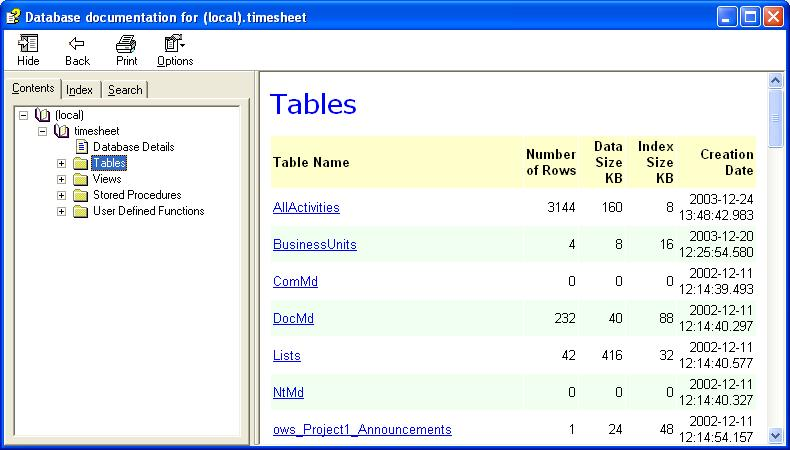



## Database Document Generator in \.CHM format

### Description

Hi friends, once I had to document a SQL Server 2000 database, the database had more than 1000 objects; I tried to document the database manually but it was a tedious job so I explored a tool which can document SQL 2000 databases, I found one known as SQL-Scribe, It was 400$ product which I could not afford so I made my own. It took me 3 days to build the tool; I have used SQL DMO to retrieve information about the database. There is a CSS file which users can change to change look and feel of the compiled

html file.

Should Have Following Installed

SQL Server 2000 SP1 Client Or Server, Compiled HTML help executable usually C:\Program Files\HTML Help Workshop\hhc.exe

Key-Words: Database, Document, Documenter, CHM, Compiled HTML, HTML Help
 
### More Info
 
CHM file of the database document.

             |
---                |---
**Submitted On**   |2004-09-21 21:36:36
**By**             |[Pradeep Mishra Induslogic](https://github.com/Planet-Source-Code/PSCIndex/blob/master/ByAuthor/pradeep-mishra-induslogic.md)
**Level**          |Advanced
**User Rating**    |4.9 (181 globes from 37 users)
**Compatibility**  |VB 6\.0
**Category**       |[Complete Applications](https://github.com/Planet-Source-Code/PSCIndex/blob/master/ByCategory/complete-applications__1-27.md)
**World**          |[Visual Basic](https://github.com/Planet-Source-Code/PSCIndex/blob/master/ByWorld/visual-basic.md)
**Archive File**   |[Database\_D1796569222004\.zip](https://github.com/Planet-Source-Code/pradeep-mishra-induslogic-database-document-generator-in-chm-format__1-56280/archive/master.zip)

